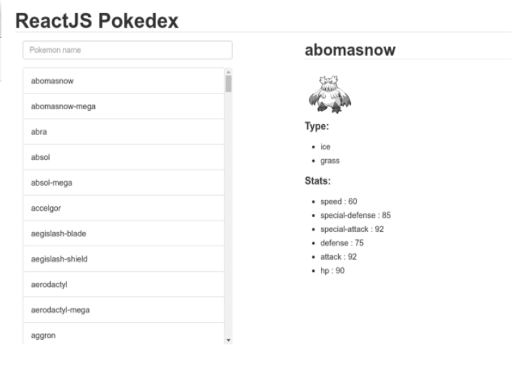

## Instructions 

### Step 1 
```
$ git clone
```

### Step 2 
```
$ npm install
```

### Step 3
```
$ npm start
```

language: javascript

topics: react, api

difficulty: 4

format: project

attribution: original

### React Pokedex
For this project you will create a pokedex app using ReactJS, jQuery (for AJAX requests) and Bootstrap. The following is the approximate layout of the app:




Below the title to the left is a list of all pokemon, and above it is a search field which filters the list in real time. To the right is some info of the selected pokemon.

The main url for the API is: https://pokeapi.co/.
An example url for a pokemon with the name 'pikachu': http://pokeapi.co/api/v2/pokemon/pikachu.

To start the app, use the command line: "npm start" and then go on a browser to http://localhost:3000/.